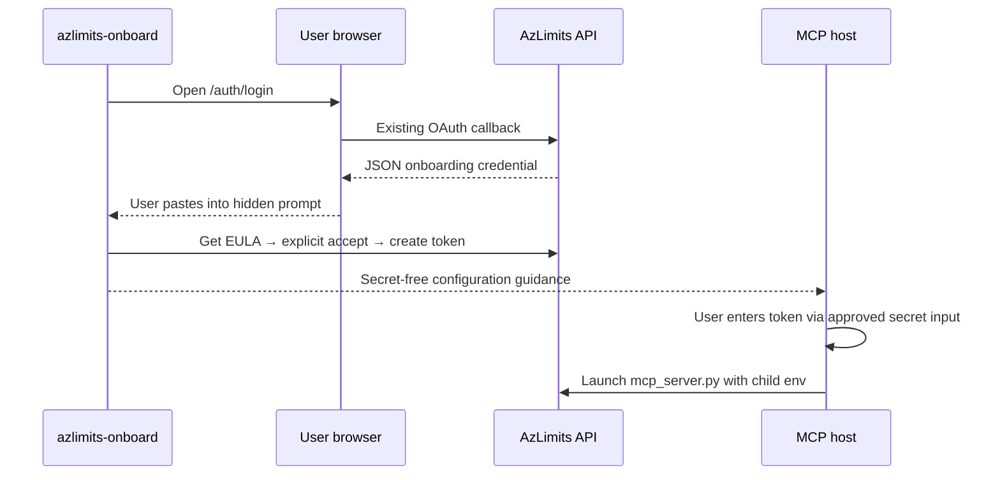

# CLI Onboarding Bootstrap — Plan Brief

> Full plan: `context/changes/cli-onboarding-bootstrap/plan.md`
> Frame brief: `context/changes/cli-onboarding-bootstrap/frame.md`

## What & Why

> **The actual problem to plan around is**: Add a safe local developer-bootstrap boundary that bridges the existing interactive, consent-based REST onboarding flow to a separately configured MCP process, without expanding the MCP server or claiming to mutate the invoking shell.

This plan adds `azlimits-onboard`, a local CLI that opens the existing browser login, safely continues the existing REST onboarding sequence after a hidden credential paste, and gives token-free MCP-host setup guidance. It removes manual HTTP work while preserving browser consent, EULA consent, one-time credentials, and the existing ownership boundaries.

## Starting Point

The API already provides browser OAuth, typed JSON callback credentials, explicit versioned EULA acceptance, and one-time API token creation. The MCP server is already a local stdio adapter that accepts only an API base URL and raw API token through its own process environment; no CLI or safe bootstrap handoff exists.

## Desired End State

A developer can run `azlimits-onboard`, approve GitHub consent, paste the callback onboarding credential into a hidden prompt, read and affirm the current EULA, and create a named API token without manually issuing REST requests. The CLI never prints the raw token or changes the caller’s environment.

The completion path directs the user to configure a user-level VS Code MCP secret input, with host-neutral requirements for other approved secret mechanisms. The existing MCP server then receives `AZLIMITS_API_BASE_URL` and `AZLIMITS_API_TOKEN` only in its child-process environment.

## Key Decisions Made

| Decision | Choice | Why | Source |
| --- | --- | --- | --- |
| OAuth handoff | Browser launch + hidden manual credential paste | The existing callback returns JSON and has no secure CLI relay; avoids API callback redesign. | Research / Plan |
| API transport | HTTPS remotely; loopback HTTP only | Protects Bearer credentials while retaining documented localhost development. | Plan |
| EULA behavior | Explicit affirmative acceptance; cancel exits | Preserves the server’s consent boundary and prevents unwanted entitlement/token side effects. | Plan |
| State-changing retries | Never auto-retry | A successful request may consume a single-use credential before a client-side failure is observed. | Research / Plan |
| Token destination | VS Code user secret guide + portable contract | Avoids parent-shell mutation, shell history, plaintext files, and MCP-server changes. | Frame / Plan |
| Automated tests | Mocked orchestration + sentinel-secret regressions | Covers deterministic high-risk behavior without live GitHub or editor-host E2E. | Plan |

## Scope

**In scope:**

- A `azlimits-onboard` console script and typed REST onboarding client.
- Browser launch, hidden callback-credential prompt, EULA display/confirmation, and named-token issuance.
- Secret-free VS Code user MCP configuration guidance and a portable host contract.
- Mocked workflow, cancellation, safe-error, and secret-leak tests; README updates.

**Out of scope:**

- API callback redesign, loopback listener/polling/device flow, browser automation, or OAuth-secret distribution.
- Database/API/MCP-server changes, direct shell mutation, persistent token files/settings, or token-bearing commands.
- Live GitHub/VS Code E2E automation and automatic retry of state-changing calls.

## Architecture / Approach

The CLI is an HTTP client only. It validates successful payloads using existing schemas and confines raw credential values to in-memory request/handoff paths. The API remains token authority; `mcp_server.py` remains a credential-free REST adapter.

## Phases at a Glance

| Phase | What it delivers | Key risk |
| --- | --- | --- |
| 1. Console command and REST client | Command registration, URL policy, typed API client, safe errors | Sending credentials to an unsafe origin or leaking them through errors |
| 2. Interactive workflow | Browser/prompt/EULA/token sequence and containment tests | Bypassing consent or replaying a consumed credential |
| 3. MCP-host handoff and docs | Token-free VS Code/portable guidance and final verification | Encouraging unsafe token storage or overpromising shell setup |

**Prerequisites:** A reachable AzLimits API; for manual verification, a disposable PostgreSQL database, GitHub OAuth application, and test identity.
**Estimated effort:** ~2–3 focused sessions across three phases.

## Open Risks & Assumptions

- The initial release retains one manual handoff: copying the browser callback credential into a hidden prompt. Fully automating that requires a separately designed API callback/handoff flow.
- VS Code secret-input behavior is host/version dependent and must be manually verified; other MCP hosts need their own approved secret mechanism.
- A failure after EULA/token POST may leave a consumed credential; restart guidance is intentionally safer than retry.

## Success Criteria (Summary)

- The CLI completes API onboarding after browser consent without manual REST calls, explicit EULA acceptance remains mandatory, and every credential stays out of normal output/logs/errors.
- Completion instructions configure the existing MCP process through a host secret boundary, never the invoking shell, token-bearing scripts, or files.
- Focused mocked tests plus the full pytest, Ruff, and mypy gates pass; a manual VS Code user-profile check proves the existing credential-free tool can run with a host-supplied token.
