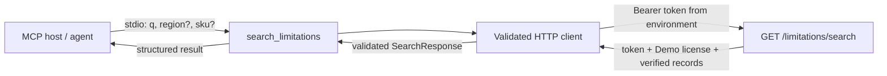

# MCP Tool Wrapper Phase 2 SDK Mismatch — Plan Brief

> Full plan: `context/changes/mcp-tool-wrapper/plan.md`
> Frame brief: `context/changes/mcp-tool-wrapper/frame.md`
> Research: `context/changes/mcp-tool-wrapper/research.md`

## What & Why

> **The actual problem to plan around is**: Phase 2 contains an SDK API assumption incompatible with the already selected and synchronized official MCP v2 package, plus an unfulfilled direct `anyio` test dependency requirement.

The plan correction keeps the protected REST forwarding design intact while making its MCP v2 integration implementable and testable against the package the project actually locks.

## Starting Point

Phase 1 added the safe `AzLimitsApiClient` boundary and locked `mcp==2.0.0`.
The active environment matches that lockfile, but v2 exports `MCPServer` rather than `FastMCP`; the intended in-memory `Client(mcp)` test harness remains available.

## Desired End State

Phase 2 will register exactly one credential-free stdio tool using MCP v2's `MCPServer` API. Its adapter tests will use `Client(mcp)` and pytest's AnyIO plugin declared directly in the development dependencies, while retaining the existing source-backed response and safe failure behavior.

## Key Decisions Made

| Decision | Choice | Why | Source |
| --- | --- | --- | --- |
| MCP server API | `mcp.server.MCPServer` | It is the official API exported by locked `mcp==2.0.0`; `FastMCP` is absent. | Frame |
| Transport | Default stdio via `mcp.run()` | Preserves the approved local-only MCP server scope. | Plan |
| Adapter test harness | In-memory `Client(mcp)` | MCP v2 supports it for an `MCPServer` without a host process. | Frame |
| Async test dependency | Direct `anyio` dev dependency | Makes the plugin required by Phase 2 explicit rather than relying on transitive installation. | Frame |

## Scope

**In scope:**
- Correct Phase 2's v2 server API contract to `MCPServer`.
- Require direct `anyio` development dependency and lockfile update.
- Retain the standard `Client(mcp)` adapter-test contract.

**Out of scope:**
- Changing the MCP major version or replacing the locked package.
- Changing REST authorization, query logic, provenance, or failure vocabulary.
- Adding an MCP HTTP transport, database access, or FastAPI integration.

## Architecture / Approach

`MCPServer("AzLimits")` hosts one typed tool, which delegates exclusively to the existing `AzLimitsApiClient`; it returns validated `SearchResponse` data or re-raises safe client exceptions. Tests connect in memory with `Client(mcp)`, with outbound REST traffic still isolated by `respx`.

## Phases at a Glance

| Phase | What it delivers | Key risk |
| --- | --- | --- |
| 2. Stdio MCP Search Tool | Correct MCP v2 server/tool and adapter tests. | API/layout drift from the locked SDK. |
| 3. Operator Setup and Slice Reconciliation | Safe local-host instructions and roadmap status. | Secret-handling guidance drifting from runtime behavior. |

**Prerequisites:** `mcp==2.0.0` remains synchronized; Phase 1 client boundary is complete.
**Estimated effort:** ~1–2 focused sessions across the remaining two phases.

## Open Risks & Assumptions

- The plan relies on the currently locked MCP v2 API; a future major SDK change requires a separate compatibility review.
- Manual stdio-host validation still needs a disposable developer token and a running AzLimits API.

## Success Criteria (Summary)

- The single tool exposes only `q`, optional `region`, and optional `sku`.
- In-memory adapter tests preserve the complete structured, provenance-backed REST response.
- Authentication, license, configuration, and upstream errors remain safe and secret-free.# MCP Tool Wrapper — Plan Brief

> Full plan: `context/changes/mcp-tool-wrapper/plan.md`
> Frame brief: `context/changes/mcp-tool-wrapper/frame.md`
> Research: `context/changes/mcp-tool-wrapper/research.md`

## What & Why

The API-side Bearer-token contract is ready, but the planned MCP surface does not yet obtain a configured token, make protected requests, or preserve the existing authorization and provenance contract. This plan adds a local stdio MCP server so an agent can query the already-protected REST search endpoint before generating or reviewing Azure IaC.

## Starting Point

`GET /limitations/search` already validates a Bearer token and active Demo license, filters to verified records, and returns a typed `SearchResponse` with a support-status verdict and complete source evidence. There is no MCP SDK, server module, configuration boundary, outbound HTTP client, or MCP test coverage today.

## Desired End State

A developer configures a local MCP host with their own `AZLIMITS_API_BASE_URL` and `AZLIMITS_API_TOKEN`, then invokes `search_limitations(q, region?, sku?)`. The tool forwards the call to the REST endpoint and returns the complete structured result without accepting, storing, logging, or exposing credentials.

Callers receive stable safe failures for configuration, authentication, inactive Demo licensing, and upstream availability. The MCP process remains a thin stdio adapter; all protected data continues to pass through the existing REST authorization boundary.

## Key Decisions Made

| Decision | Choice | Why | Source |
| --- | --- | --- | --- |
| Server location | Separate local stdio process | Preserves the REST auth boundary without coupling MCP transport to FastAPI. | Plan |
| MCP implementation | Official `mcp` Python SDK v2 | Protocol-owner SDK supports typed tool registration and stdio on Python 3.12. | Plan |
| Credential ownership | Per-developer environment settings | Matches the PRD’s developer-configured token model and isolates expiry/revocation. | Plan |
| Data path | HTTP forwarding only | The existing endpoint already enforces token, license, verified-only, and provenance rules. | Frame / Research |
| Success result | Full structured REST response | Keeps the verdict and all source evidence intact for agent decisions. | Plan |
| Failure behavior | Dedicated exception whose message starts with a stable code; SDK `is_error=True` | Official SDK v2 has no typed error-code field; `MCPError` hides the message from the model. | Plan review |
| HTTP client bounds | `httpx.Timeout(10.0)` and `follow_redirects=False` | Prevents hung agent calls and Bearer replay onto a redirected host. | Plan review |

## Scope

**In scope:**

- Official MCP SDK dependency and lock update.
- Environment-based MCP configuration and bounded authorized `httpx` client.
- One `search_limitations` stdio tool returning `SearchResponse` unchanged.
- Mocked regression tests, secure local setup guidance, and S-03 roadmap reconciliation.

**Out of scope:**

- Any FastAPI, query-core, database, token-lifecycle, or REST-contract change.
- Remote MCP transport/deployment, interactive OAuth, shared service tokens, retries, caching, filtering, or result summarization.

## Architecture / Approach

The client is the only route from MCP to protected data. It validates successful payloads with the existing Pydantic `SearchResponse`, so incomplete provenance and unexpected upstream responses fail safely before reaching an agent.

## Phases at a Glance

| Phase | What it delivers | Key risk |
| --- | --- | --- |
| 1. Authorized REST Client Boundary | Safe config, Bearer forwarding, response validation, and error mapping | Token or upstream details leak through errors/logs. |
| 2. Stdio MCP Search Tool | Official-SDK tool registration and credential-free structured result | Adapter bypasses or weakens the tested client boundary. |
| 3. Operator Setup and Slice Reconciliation | README setup and active S-03 roadmap state | Users configure secrets unsafely or mistake local stdio for remote MCP. |

**Prerequisites:** Completed REST search/query core, a reachable AzLimits API, and a developer-owned Demo-licensed API token from the existing onboarding flow.

**Estimated effort:** ~2–3 sessions across 3 phases.

## Open Risks & Assumptions

- The official MCP SDK v2 API must be pinned and used according to its current documentation during implementation.
- The local MCP host must provide secrets through an approved environment/secret mechanism; the application cannot protect a token entered into an unsafe host configuration.
- API availability and the existing 500-record response limit bound tool responsiveness; this plan uses a 10-second timeout and no automatic retries.

## Success Criteria (Summary)

- The MCP tool forwards the configured Bearer token and all query inputs only to the protected REST search endpoint.
- Successful structured output preserves the support verdict and every required source/provenance field.
- Invalid configuration, expired/invalid tokens, inactive licenses, and unavailable upstream responses are distinguishable without exposing secrets or server bodies.
- A developer can configure and launch the local stdio tool from the README without database or OAuth application settings.
