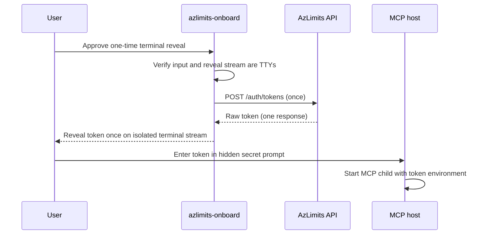

# Token reveal handoff — Plan Brief

> Full plan: `context/changes/token-reveal-handoff/plan.md`
> Frame brief: `context/changes/token-reveal-handoff/frame.md`

## What & Why

> **The actual problem to plan around is**: The CLI receives the API's one-time raw token but has no production, explicitly user-mediated confidential handoff into an MCP host's approved secret-entry boundary before the value is discarded.

This plan makes the token usable exactly once through an explicit, TTY-guarded terminal reveal. It retains the existing secret-free VS Code MCP template and prevents storage, parent-process configuration, generic-output leaks, and token retries.

## Starting Point

The API creates a raw token once and stores only its hash. The CLI already receives that raw value through a test-only `completion_handoff` seam, but the console entry point leaves it unbound and then prints a template requiring a token the user cannot obtain. The MCP server already consumes a host-provided child-process token.

## Desired End State

After EULA acceptance and token naming, a user explicitly approves a visible, one-time terminal reveal. The CLI requires interactive input and output before token issuance, then reveals the new token once so the user can immediately enter it into the MCP host’s hidden secret prompt. Normal CLI output stays token-free and the existing MCP server remains unchanged.

## Key Decisions Made

| Decision | Choice | Why | Source |
| --- | --- | --- | --- |
| Handoff model | Reveal once on a verified terminal | Restores a usable one-time transfer without persistence or host automation. | Plan |
| Consent | Separate affirmative reveal confirmation | EULA acceptance must not implicitly authorize secret disclosure. | Plan |
| Terminal eligibility | Require input and reveal output TTYs | Rejects scripted approval and redirected token output before irreversible issuance. | Plan |
| Post-issuance stream failure | Safe failure; no retry | The token may be consumed and must not be shown again or exposed in errors. | Plan |
| MCP boundary | Preserve host child-environment configuration | API issuance and MCP token intake work as designed. | Frame |

## Scope

**In scope:**

- Explicit TTY-guarded confirmation and single terminal reveal in `azlimits-onboard`.
- Isolated reveal/output failure tests and updated onboarding instructions.
- Manual VS Code user-level secret handoff verification.

**Out of scope:**

- API, database, schema, OAuth, token-storage, and MCP-server changes.
- Clipboard, keychain, secret-store, VS Code automation, files, `.env`, registry, or shell-environment persistence.
- Token retries, recovery, or parent-process mutation.

## Architecture / Approach

The guard and explicit confirmation complete before token issuance. The raw value flows only from the validated API response to a dedicated reveal stream, then is discarded; generic status output continues to contain only token-free guidance.

## Phases at a Glance

| Phase | What it delivers | Key risk |
| --- | --- | --- |
| 1. Guarded one-time reveal | Production completion handoff with pre-issuance TTY/consent checks | Irrecoverable token issuance in an unsafe terminal context |
| 2. Regression coverage and guide | Secret-isolation tests and accurate VS Code transfer instructions | Accidental disclosure or ambiguous recovery behavior |

**Prerequisites:** Disposable API, GitHub OAuth test identity, and a clean/test VS Code profile for manual validation.
**Estimated effort:** ~2 focused sessions across 2 phases.

## Open Risks & Assumptions

- Terminal reveal exposes the token to user-managed scrollback, recording, remote-session, or screen-sharing risks.
- Some IDE terminal configurations may not report as TTYs and will be intentionally refused.
- A reveal stream failure after issuance means the token is not recoverable; the user must restart onboarding.

## Success Criteria (Summary)

- A confirmed interactive user can transfer a newly issued token into a host secret prompt exactly once.
- Noninteractive, declined, cancelled, and failed reveal paths never expose a token or issue/retry a token incorrectly.
- VS Code starts the unchanged MCP server with user-level secret configuration and no token-bearing artifacts or parent-process changes.
